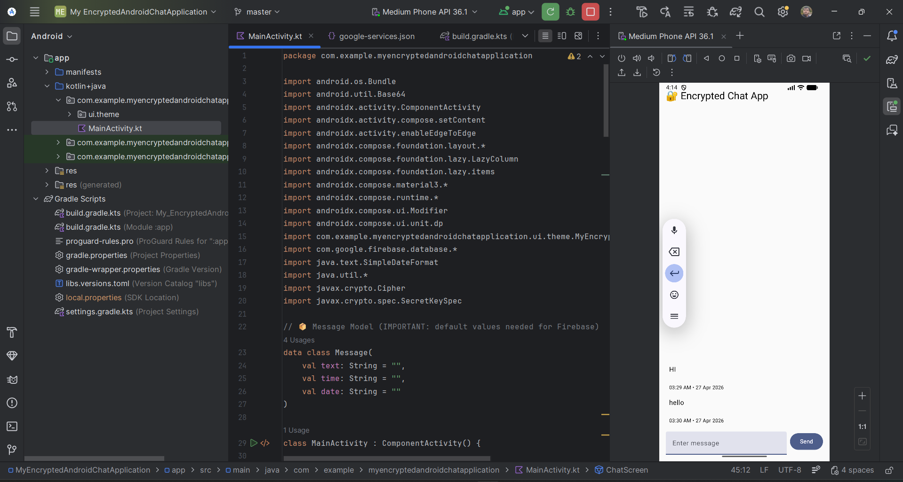
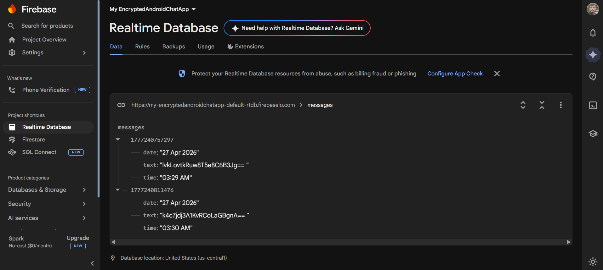

# 🔐 Encrypted Android Chat App

A simple Android chat application that uses **AES encryption** to secure messages and **Firebase Realtime Database** for storing and syncing data.

---

## 🚀 Features

* 🔐 AES Encryption (client-side)
* ☁️ Firebase Realtime Database integration
* 💬 Send & receive messages
* 🕒 Timestamp (date & time)
* 📱 Modern UI using Jetpack Compose

---

## 🛠️ Tech Stack

* Kotlin
* Jetpack Compose
* Firebase Realtime Database
* AES Encryption (Javax Crypto)

---

## ⚙️ Setup Instructions

### 1️⃣ Firebase Setup

* Go to 👉 https://console.firebase.google.com/
* Create a new project
* Enable **Realtime Database**
* Set rules:

```json
{
  "rules": {
    ".read": true,
    ".write": true
  }
}
```

---

### 2️⃣ Add Firebase to Android

In `build.gradle.kts (Project)`:

```kotlin
id("com.google.gms.google-services") version "4.4.4" apply false
```

In `build.gradle.kts (Module)`:

```kotlin
implementation("com.google.firebase:firebase-database")
```

* Add `google-services.json` to your app folder

---

### 3️⃣ Main Logic

* Messages are encrypted using AES before sending
* Stored in Firebase
* Decrypted when displayed in UI

---

## 📸 Screenshots

### 🔹 App UI



### 🔹 Firebase Database



---

## 🔑 Encryption Example

```kotlin
val key = "1234567890123456"
```

> ⚠️ This is a demo key. Do NOT use hardcoded keys in production.

---

## 📌 Notes

* This is a prototype project for learning purposes
* Security can be improved using:

  * Secure key storage
  * Firebase Authentication
  * End-to-end encryption

---

## 👨‍💻 Author

**Ayush Kumar**

---

## ⭐ If you like this project

Give it a ⭐ on GitHub
